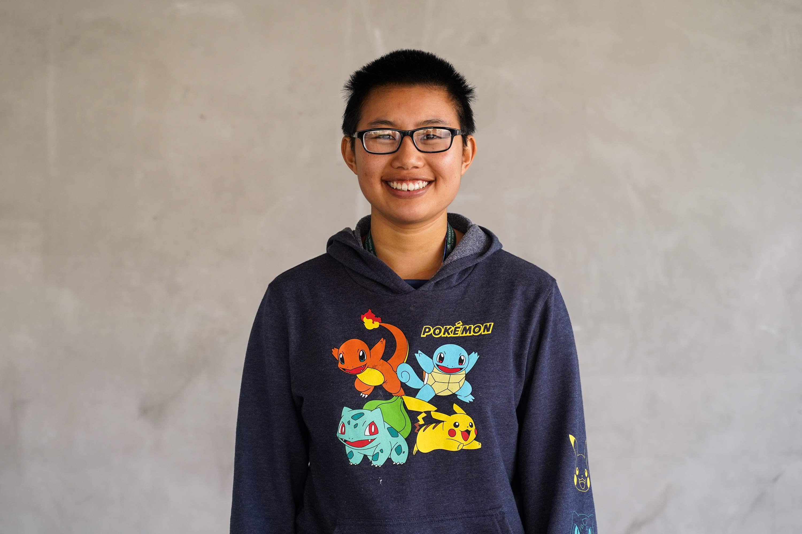
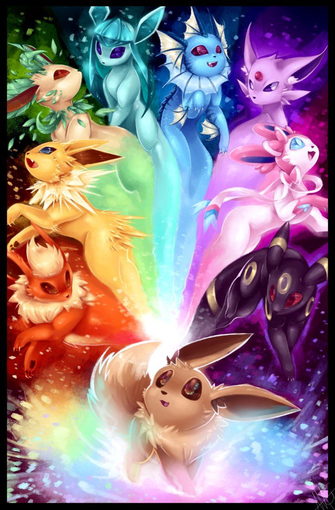

# README

<https://usf-cs360-spring2020.github.io/template-bulma/>

<https://usf-cs360-spring2020.github.io/web-jghuynh/>

**Name:** Justine Huynh
**Email:** <jghuynh@dons.usfca.edu>

Hello!

I am Justine Huynh, a Senior Data Science girl. I will graduate in May 2020.
I love Pokémon, pink, poké, playing piano, alliterations, and swimming.

My favorite Pokemon is Latias.

Here are some of my favorite Pokémon pictures that I wish were posters in my bedroom.

This is a template website using [Bulma](https://bulma.io/), [FontAwesome](https://origin.fontawesome.com/) for icons, and [Github Pages](). Designed to be modified (including this README file).

*Template based on: <https://github.com/usf-cs360-spring2020/template-bulma>*
